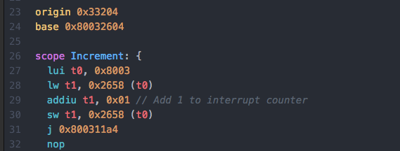

# Bass Assembler N64-MIPS language syntax highlighting in Atom

Adds syntax highlighting to Bass Assembler N64 MIPS files in Atom. MIPS instructions are based on instructions implemented in [ARM9's branch of Bass with N64 support](https://github.com/ARM9/bass).

Register Names (T0, AT, S1) and N64 register numbers (r0, r1, r27) are also highlighted, even though they technically aren't part of bass (you need to include them as constants).

None of the RCP instructions are highlighted, as of now.

Contributions are greatly appreciated. Please fork this repository and open a
pull request to add snippets, make grammar tweaks, fix my awful regexes, etc.
